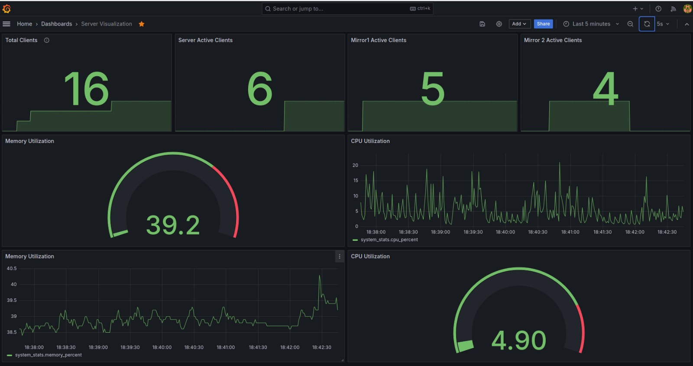

# NetSocket

## Overview

#### NetSocket - Client Server Architecture with Load Balancing and File Transfer using Sockets

This project presents a robust client-server architecture implemented in C, facilitating multiple clients to interact with a server system efficiently. The server, termed as serverw24 along with its mirror instances, enables clients to execute various commands, including file retrieval, searching, and downloading, via socket connections. Load balancing is achieved through a Round Robin mechanism, ensuring equitable distribution of client requests among server instances.

The system architecture also incorporates real-time monitoring and visualization capabilities. Statistics such as the number of connected clients, CPU and memory utilization are collected and pushed into a Kafka queue, then stored in InfluxDB for persistent storage. Grafana is employed for visualization and monitoring purposes, offering stakeholders valuable insights into system performance and resource utilization.

The project adheres to strict guidelines, including individual or team-based project development, plagiarism checks via MOSS, and scheduled demonstrations followed by viva sessions. Submission includes well-commented C files for server, client, and mirror instances, ensuring clarity and ease of understanding for future development and maintenance.

Overall, this project offers a comprehensive solution for scalable client-server communication, incorporating load balancing and real-time monitoring functionalities to meet the demands of modern networked environments.

## Screenshots
  

## Demo

## Contributions 

## Contributors 
  - [Hayden Cordeiro](https://hayden.co.in/) 
  
  

- [Jivin Varghese Porthukaran](https://jivin.co.in/) 
  
  
